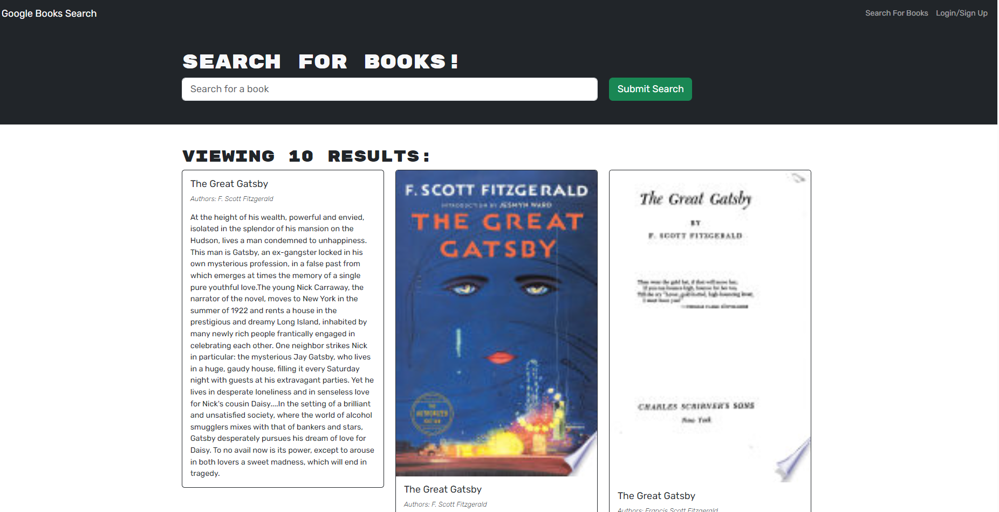

# Book Search Engine 

## Description
This project involves refactoring a fully functioning Google Books API search engine from a RESTful API architecture to a GraphQL API architecture using Apollo Server. The application is built with the MERN stack, including a React front end, MongoDB database, and Node.js/Express.js server. It allows users to search for books and save their searches to the backend.

## Table of Contents

- Description
- Table of Contents
- Installation
- Technology
- Questions
- Link
- Screenshot

## Installation
1. Clone the repository: `git@github.com:sarahizar/Book_Engine.git`
2. Navigate to the project directory
3. Install server and client dependencies: `npm run install`
4. Start the development server: `npm run develop`

## Technology
- React
- Vite
- Heroku
- MongoDB

## Questions 
If you have any questions, please feel free to reach out:
- GitHub: [sarahizar](https://github.com/sarahizar)
- Email: sara.hizar@outlook.com

## Link
https://github.com/sarahizar/Book_Engine

## Screenshot

